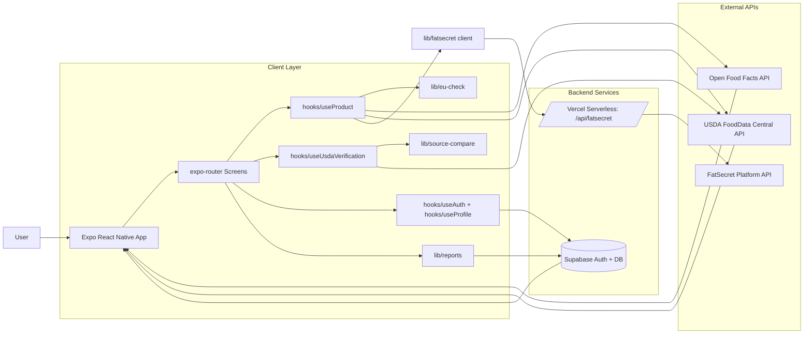

# Solution Architecture Document (SAD)

## 1. Overview

**Project:** EU David  
**Platform:** Expo React Native app (iOS-first, web-capable)  
**Primary purpose:** Let users scan or search food products, evaluate EU additive compliance, and review product ingredient signals (including gluten/palm-oil alerts).

The app uses a hybrid data strategy:
- Open Food Facts (OFF) for barcode/product ingredient records.
- USDA FoodData Central for expanded search coverage and fallback ingredient/nutrition data.
- FatSecret (proxied via serverless API) for nutrition enrichment by barcode.
- Supabase for auth, profile/history persistence, and user issue reports.

---

## 2. Tech Stack

### Client
- `expo` `~54.0.33`
- `react` `19.1.0`
- `react-native` `0.81.5`
- `expo-router` `~6.0.23`
- `@tanstack/react-query` `^5.96.2`
- `react-native-safe-area-context`, `react-native-gesture-handler`, `react-native-reanimated`
- `lucide-react-native` for icons

### Backend / Services
- **Supabase** (`@supabase/supabase-js`) for:
  - Auth/session
  - Scan history table
  - Product report submission table (`product_reports`)
- **Vercel Serverless Function** (`api/fatsecret.ts`) for FatSecret OAuth + product lookup proxy

### External APIs
- **Open Food Facts API**
  - Product by barcode: `/api/v2/product/{barcode}.json`
  - Search: `/api/v2/search`
- **USDA FoodData Central API**
  - Food search and food details (`/foods/search`, `/food/{fdcId}`)
- **FatSecret Platform API** (server-side only, tokenized through Vercel function)

### Testing / Tooling
- TypeScript + ESLint + Prettier
- Playwright for web E2E flows
- Expo export-based static web test serving (`scripts/serve-web-tests.mjs`)

---

## 3. Integrations and Responsibilities

## 3.1 Open Food Facts (OFF)
- Primary source for:
  - Barcode lookups
  - Ingredients text
  - Additives tags (`additives_tags`)
  - Allergen tags
- Also used to reconcile USDA-origin search items to official OFF product records when a strong name/brand match is found.

## 3.2 USDA FoodData Central
- Used by search to broaden item coverage when OFF misses products.
- Used for:
  - Branded product search candidates
  - Product nutrition and ingredient fallback
- USDA pseudo-barcode format: `usda-{fdcId}` for navigation continuity.

## 3.3 FatSecret (via `/api/fatsecret`)
- Server-side credential-protected integration.
- Looks up nutrition from barcode via:
  1. OAuth token fetch
  2. Barcode -> food ID lookup
  3. Food details fetch
- Client reads this as normalized nutrition facts for product page display.

## 3.4 Supabase
- Auth/session used by app shell and route gating.
- Persists scan history.
- Accepts user issue reports (`missing ingredients`, `misinformation`) from:
  - Search item card action
  - Product detail page action

---

## 4. Application Modules

### Routing / App shell
- `app/_layout.tsx`: React Query provider + auth-gated stack.
- `app/(tabs)/_layout.tsx`: tab navigation (`Scan`, `History`, `Search`, `Profile`).

### Primary user flows
- `app/(tabs)/index.tsx`: barcode scanner entry.
- `app/(tabs)/search.tsx`: name/barcode search; USDA + OFF combined result strategy.
- `app/product/[barcode].tsx`: detailed product page with:
  - EU compliance card
  - Optional nutrition reveal (intentional button tap)
  - Gluten and palm-oil alerts
  - OFF vs USDA source verification
  - User issue reporting modal
- `app/(tabs)/history.tsx`: prior scans.

### Domain/data logic
- `lib/openfoodfacts.ts`: OFF fetch/search/parse helpers.
- `lib/usda.ts`: USDA query/detail parsing + nutrition extraction.
- `lib/fatsecret.ts` + `api/fatsecret.ts`: nutrition integration.
- `lib/eu-check.ts`: additive rule checks and compliance scoring.
- `lib/source-compare.ts`: OFF vs USDA ingredient findings comparison.
- `lib/reports.ts`: report submission helper to Supabase.

### Hooks
- `hooks/useProduct.ts`: orchestrates product data resolution.
  - Barcode path: OFF + FatSecret.
  - USDA pseudo-barcode path: USDA detail -> OFF reconciliation -> EU check.
- `hooks/useUsdaVerification.ts`: source verification query.
- `hooks/useAuth.ts`, `hooks/useProfile.ts`, scanner/history hooks.

---

## 5. Key Runtime Flows

### 5.1 Scan -> Product Compliance
1. User scans barcode.
2. Product route loads by barcode.
3. OFF provides ingredients/additives/allergens.
4. FatSecret enriches nutrition (if available).
5. EU compliance engine computes banned/restricted/warning/approved/unknown.
6. User can optionally reveal nutrition facts.

### 5.2 Search -> Product -> Compliance
1. Search query runs OFF + USDA fallback.
2. User taps a result.
3. If USDA-origin result:
   - Load USDA detail.
   - Attempt OFF reconciliation by name/brand for official ingredients.
   - Prefer OFF ingredients on strong match.
4. Product page renders compliance + optional nutrition.

### 5.3 Reporting Data Quality Issues
1. User taps `Report Issue` (search row) or report button on product page.
2. Select issue type + optional details.
3. Submit to Supabase `product_reports`.
4. UI confirms success/failure gracefully.

---

## 6. Environment and Configuration

Expected environment variables (do not commit real values):
- `EXPO_PUBLIC_SUPABASE_URL`
- `EXPO_PUBLIC_SUPABASE_ANON_KEY`
- `EXPO_PUBLIC_USDA_API_KEY`
- `FATSECRET_CLIENT_ID`
- `FATSECRET_CLIENT_SECRET`
- `EXPO_PUBLIC_API_URL` (for client to call deployed `/api/fatsecret`)

---

## 7. Key Scripts and Commands

From `package.json`:
- `npm run start` -> Expo dev server
- `npm run ios` / `npm run android`
- `npm run web`
- `npm run export` -> static web export
- `npm run lint`
- `npm run type-check`
- `npm run format` / `npm run format:check`

Testing support:
- `playwright.config.ts` uses `scripts/serve-web-tests.mjs`
- `scripts/serve-web-tests.mjs`:
  - exports web build if needed
  - hosts static dist content for Playwright

---

## 8. Reference Architecture Diagram

---

## 9. Notes / Current Scope

- Detector feature has been removed to focus on core scan/search/product workflows.
- Product page intentionally gates nutrition details behind explicit user action (`Show Nutrition Facts`).
- EU compliance should not show positive approval when ingredient data is unavailable; unknown state is surfaced.
